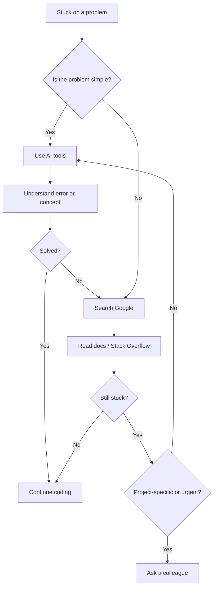

# Help Strategy Flowchart

```mermaid
flowchart TD
    A[Stuck on a problem] --> B{Is the problem simple?}

    B -- Yes --> C[Use AI tools]
    C --> C1[Understand error or concept]
    C1 --> D{Solved?}
    D -- Yes --> Z[Continue coding]
    D -- No --> E[Search Google]

    B -- No --> E[Search Google]
    E --> E1[Read docs / Stack Overflow]
    E1 --> F{Still stuck?}

    F -- No --> Z[Continue coding]
    F -- Yes --> G{Project-specific or urgent?}

    G -- Yes --> H[Ask a colleague]
    G -- No --> C
```
